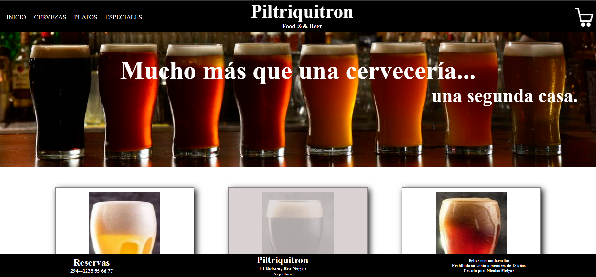

# React + Vite
# Proyecto FInal
## Carrera: "Desarrollador web Frontend React JS"
### Curso: "React JS"
### Profesor: Daniel Di Salvo

Ecommerce creado para el trabajo final del curso en Coderhouse.

Tecnologías usadas React - React router dom - Firebase - Context - npm - CSS - HTML - 

Para correr el proyecto

> git clone
> npm install
> npm run dev

 El proyecto tiene un deploy en: [Proy-React Netlify]([https://app.netlify.com/sites/ecommerce-react-pf-coderhouse/overview](https://ecommerce-react-pf-coderhouse.netlify.app/).

 
